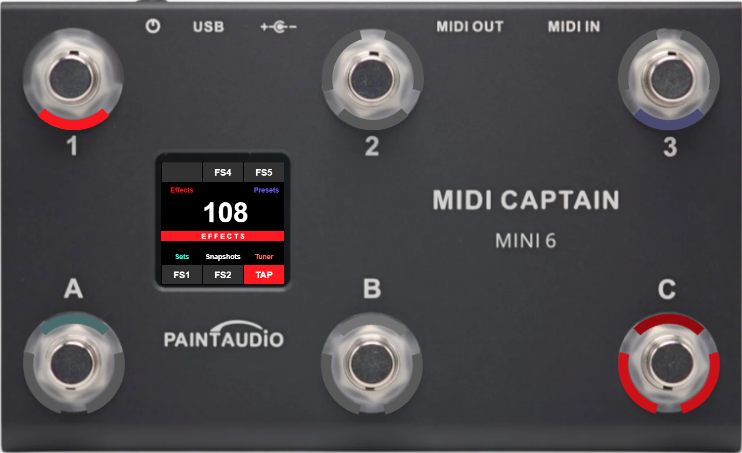
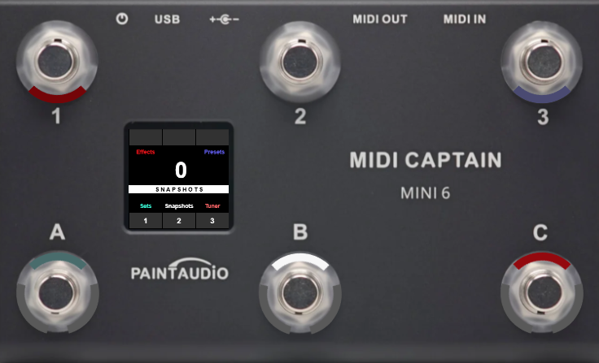
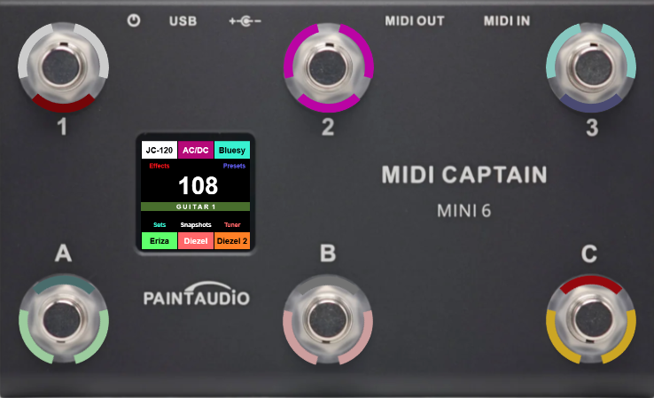
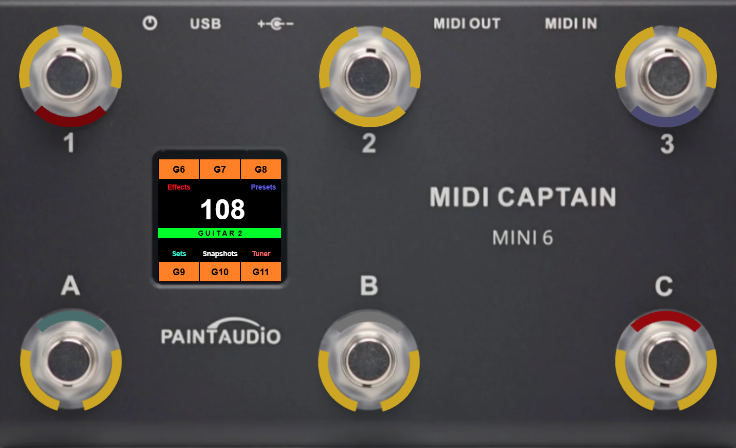
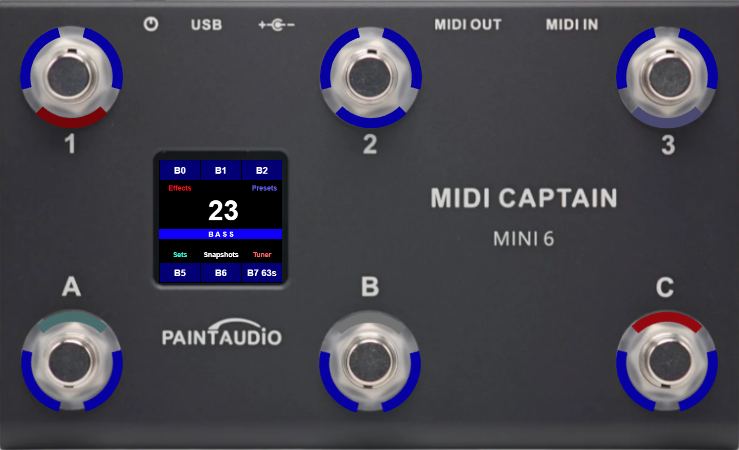
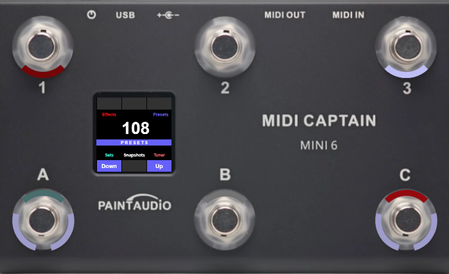
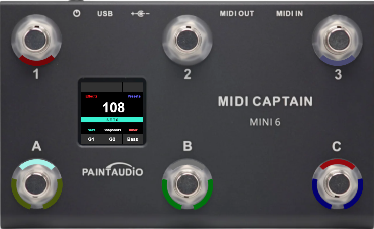

# HX Stomp – PySwitch Configuration Example

This configuration example adds support for controlling a **Line 6 HX Stomp** using a **MIDI Captain Mini‑6** controller through PySwitch. It demonstrates how to integrate both USB and DIN MIDI communication and how to map the controller’s switches to the Stomp’s footswitch logic in a practical, performance‑ready setup.

Since an image is worth a thousand words, see the switches configuration table and associated image to get an idea.

### Additional Customization
Of course, the **Guitar 1**, **Guitar 2**, and **Bass** presets pages included in this example are simply my personal take on organizing sounds. Feel free to adapt labels, colors, or add/remove entire pages to suit your own workflow.

## HX Stomp Requirements

To ensure the configuration behaves as expected, the HX Stomp must be set up with the following parameters:

- **Stomp Mode view** enabled
- **FS3** assigned to **TAP**
- **FS4** mapped to **Stomp 4**
- **FS5** mapped to **Stomp 5**

With this setup, **TAP functionality works correctly**, and the controller can reliably toggle individual stomps while also sending program changes.

## MIDI Behavior

The included `communication.py` file enables **both USB and DIN MIDI communication (in and out)**, allowing the controller to interact with the HX Stomp regardless of the chosen connection method.

Program Change (PC) messages are used to **update the preset label on the controller’s screen**—this is the only meaningful feedback the HX Stomp provides over MIDI for this use case.

---

### ⚠️ Important Note
*The HX Stomp MIDI specification does not provide ways to query button states nor does it send state‑change messages. Because of this limitation, switch colors cannot be updated dynamically. The only bidirectional update available is the Program Change message, which is supported in this configuration.*

## Pages and Switch configuration reference

> ### Sticky options (always available, identied with * in other pages)
>
> | Button | Short Press        | Long Press         |
> |--------|--------------------|--------------------|
> | 1      |  -                 | Effects Page       |
> | 2      |  -                 | -                  |
> | 3      |  -                 | Presets Page       |
> | A      |  -                 | Sets Page          |
> | B      |  -                 | Snapshots Page     |
> | C      |  -                 | Tuner              |

### Page 1 – EFFECTS PAGE

| Button | Short Press        | Long Press         |
|--------|--------------------|--------------------|
| 1      | -                  | *Effects Page      |
| 2      | FS4                |  -                 |
| 3      | FS5                | *Presets Page      |
| A      | FS1                | *Sets Page         |
| B      | FS3                |	*Snapshots Page    |
| C      | TAP                | *Tuner             |

### Page 2 - SNAPSHOTS PAGE

| Button | Short Press        | Long Press         |
|--------|--------------------|--------------------|
| 1      | -                  | *Effects Page      |
| 2      | -                  |  -                 |
| 3      | -                  | *Presets Page      |
| A      | Snapshot 1         | *Sets Page         |
| B      | Snapshot 2         |	*Snapshots Page    |
| C      | Snapshot 3         | *Tuner             |

### Page 3 - GUITAR 1 PAGE

| Button | Short Press        | Long Press         |
|--------|--------------------|--------------------|
| 1      | Bank 0             | *Effects Page      |
| 2      | Bank 1             |  -                 |
| 3      | Bank 2             | *Presets Page      |
| A      | Bank 3             | *Sets Page         |
| B      | Bank 4             |	*Snapshots Page    |
| C      | Bank 5             | *Tuner             |

### Page 4 - GUITAR 2 PAGE

| Button | Short Press        | Long Press         |
|--------|--------------------|--------------------|
| 1      | Bank 6             | *Effects Page      |
| 2      | Bank 7             |  -                 |
| 3      | Bank 8             | *Presets Page      |
| A      | Bank 9             | *Sets Page         |
| B      | Bank 10            |	*Snapshots Page    |
| C      | Bank 11            | *Tuner             |

### Page 5 - BASS 1 PAGE

| Button | Short Press        | Long Press         |
|--------|--------------------|--------------------|
| 1      | Bank 18            | *Effects Page      |
| 2      | Bank 19            |  -                 |
| 3      | Bank 20            | *Presets Page      |
| A      | Bank 21            | *Sets Page         |
| B      | Bank 22            |	*Snapshots Page    |
| C      | Bank 23            | *Tuner             |

### Page 6 - PRESETS PAGE

| Button | Short Press        | Long Press         |
|--------|--------------------|--------------------|
| 1      | -                  | *Effects Page      |
| 2      | -                  |  -                 |
| 3      | -                  | *Presets Page      |
| A      | Bank Down          | *Sets Page         |
| B      | -                  |	*Snapshots Page    |
| C      | Bank Up            | *Tuner             |

### Page 6 - SETS PAGE

| Button | Short Press        | Long Press         |
|--------|--------------------|--------------------|
| 1      | -                  | *Effects Page      |
| 2      | -                  |  -                 |
| 3      | -                  | *Presets Page      |
| A      | Guitar 1 set       | *Sets Page         |
| B      | Guitar 2 set       |	*Snapshots Page    |
| C      | Bass set           | *Tuner             |
